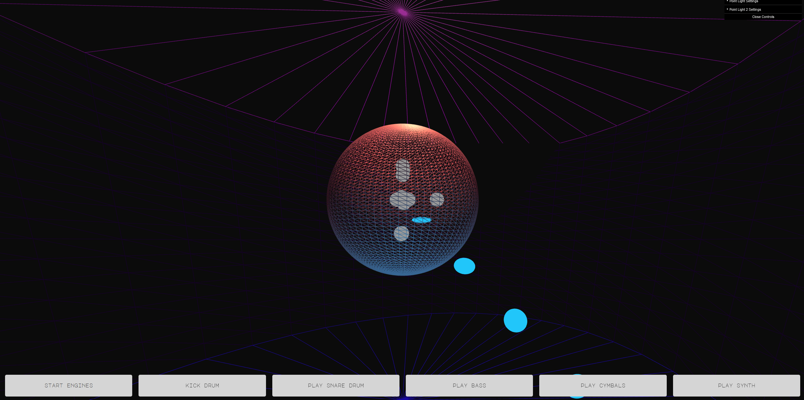
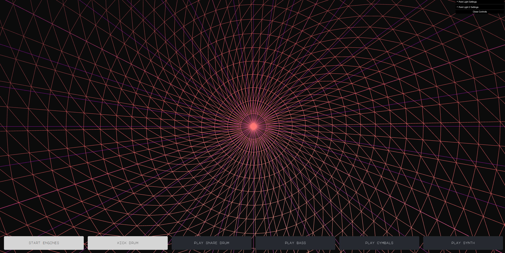

## Setup
Download [Node.js](https://nodejs.org/en/download/).
Run the followed commands:

# Install dependencies (only the first time)
npm install

# Run the local server at localhost:8080
npm run dev

# In the browser click start engines then activate the sample you want to play

# Screenshots

Three.js Starter template Courtesy of Bruno Simon of https://threejs-journey.xyz/add
